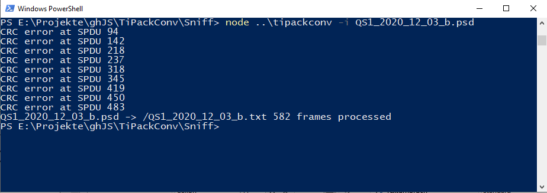

# TiPackConv

Converter for files generated by the **Ti Packet Sniffer** into Excel compatible txt format.
' ' used as delimiter.

## Usage:

node tipackconv -i input file [-o output file] [-v]

## Example:

# Apendix:

todo

 
